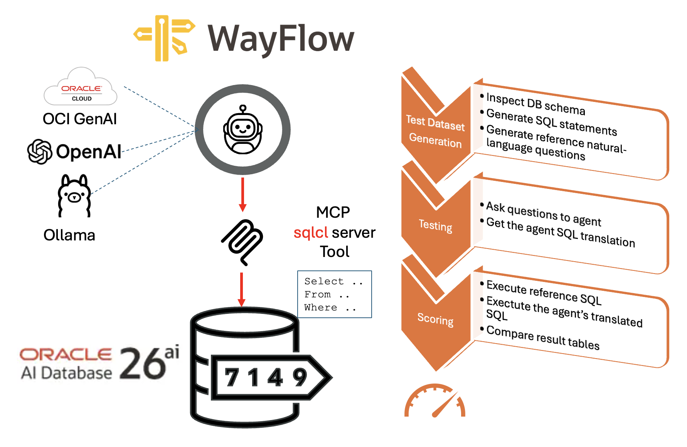

# Automated NL2SQL testing
Someone, not having always reliable translations from SQLcl Wayflow agent proposed in the previous post, it has asked me how to compare different prompts or, eventually, more sophisticated approach to Natural Language to SQL translation.
Here a proposal to:
- Generate from an existing schema a collection of Question -> SQL statement
- Test dataset accuracy



## Overview
This example leverages the [DataFlow project](https://github.com/OpenDCAI/DataFlow), an Open Source framework (Apache-2.0 license), that is a data preparation and training system that turns noisy sources (PDFs, plain text, low-quality QA) into high-quality data to boost domain LLM performance via targeted training (pre-training, SFT, RL) or RAG with cleaned knowledge bases, validated in healthcare, finance, and law.
In particular I've used the Text2SQL Pipeline, to translates natural language questions into SQL queries, supplemented with explanations, chain-of-thought reasoning, and contextual schema information.
Without running all the original phases, it has been used in the Test Dataset Generation to:

- Inspect DB schema
- Generate SQL statements
- Generate reference natural-language questions
This allow an independent, bias free approach to the Question/SQL generation by the agent you are going to test, that start from consistent SQL generated looking at the actual schema, and from that will be formulated the reference question.

After having generated a jsonl file with the question list, you can start the Testing phase, in which each question will be submitted to the agent, that has been modified to return the SQL only, and collecting the translated SQL.

The scoring phase I've implemented comparing the tables coming from the queries. I've preferred this approach from analyzing the queries by syntactical/semantic point of views, since quite more complex. This method is quite often used in benchmark evaluation, like Spider [1.0](https://yale-lily.github.io/spider) and [2.0](https://spider2-sql.github.io/) and with static DB schema is reliable. Few parameters I've introduced to tune the matching criteria.

Finally is computed a percentage from the correct translations on the total number of question. 


## Test Dataset Generation
It will be executed by: `text2sql_pipeline_gen.py`, with the support of the connector developed for the Oracle DBMS `oracledb_connector.py`, based on MySQL implementation.

Setting the `user`/schema are you interested to test your agent, for example the SH used in the original agent, and providing the credentials, in addition to llm references for chat/embeddings required:
```sql
    DB_CFG = {
            'user': 'SH',
            'password': 'Welcome_12345', 
            'host': 'localhost',
            'port': 1521,
            'service_name': 'FREEPDB1'
        }

    LLM_CFG =  {
            'chat_model': 'gpt-4o-mini',
            'chat_url' : 'https://api.openai.com/v1/chat/completions',
            'embedding_model' : 'text-embedding-3-small',
            'embedding_url': 'https://api.openai.com/v1/embeddings'
        }

    GEN_CONF = {
            'nq':10
        }
```
The modified `text2sql_pipeline_gen.py` will execute only the first three steps:
1. SQLGenerator: is responsible for generating SQL query statements based on the database schema, providing raw SQL data for subsequent data processing flows. Automatically generates SQL query statements based on the database schema
2. SQLExecutionFilter: verifies the correctness of SQL statements by actually executing them, filtering out SQL statements that cannot be executed normally.
3. Text2SQLQuestionGenerator: generates corresponding natural language questions based on given SQL statements, constructing Text-to-SQL question-answer pairs.S Supports generating multiple candidate questions.

The output file will be the 'cache/dataflow_cache_step_step3.jsonl', that will be modified to add a list of golden fields in future and stored as 'cache/dataflow_cache_step_step3_updated.jsonl'

## Testing
It will be executed by: `howto_mcp_sqlcl_test.py`
The original agent file has been modified to generate SQL only, setting in the prompt:

```python
### Output Format
- Return ONLY the final raw SQL generated
- Do NOT include explanations, comments, or debug output

You are not allowed to skip schema validation.
You are not allowed to return raw SQL without execution
```
The questions collection will be get by:
- `cache/dataflow_cache_step_step3_updated.jsonl`

and the related SQL translated will be added in the file:
- `cache/dataflow_cache_step_step3_q_a.jsonl`  

## Scoring

It will be executed by: `evaluate_sql.py`

Currently the scoring is based on the percentage coming from ratio `positive_matching / total question`. In a more sophisticated approach, it could be annotated in reference queries the MUST-TO-BE fields in the translated query, but it requires a manual effort, to make more tolerant the scoring system.

The match, positive or negative, is based on SQL query results.

Since the translated SQL (B) could include more fields that the reference (A), that could be tolerated or not, as well as the result of analytical function, a fast + exact approach to implementation has been:
	1.	Remove extra columns from B using a column fingerprint (row-order invariant).
	2.	Now A and B_reduced have same shape.
	3.	Try to match/permutate columns, but order the search by “most discriminative first” (variance can be part of that).
This avoids trying all column permutations.

Rows can be permuted, columns can be permuted, and B may have extra columns, with strong pruning. It uses a fingerprint (multiset) + backtracking, and it naturally “permutes columns” but only where needed.

To control the level of similarity between reference SQLs (A) and translated SQLs (B), it's possible to tune some parameters like:

- **require_same_columns**: determine if the columns must be equal and the same. If False, to be positive the match, all the columns coming from reference SQL (A) must be in the translated one (B), even with different names.
    - True: B must have same #columns as A (no pruning/subset selection)
    - False: B may have extra columns; try to match A inside B
- **require_same_columns_names**: if True, event the column names must be equal in translated sql returns.
- **consider_duplicates**: if False, the equal records are considered by one only
- **float_factor**: it defines a tolerance factor for the float number content. It's quite useful if some column is the result of avg() or other mathematical calculation that for the approximations could introduce a little difference. The results are normalized before to compare the results. It compares floats by int(round(v * float_factor)), e.g. 100 => 2 decimal places
- **ignore_order**: it does mean:
    - False: only column permutation (rows fixed) match
    - True : column permutation + row permutation allowed to determine similarity
    if ORDER BY in reference SQL, ignore_order is automatically set to False.

The output will be in `cache/dataflow_cache_step_step3_q_a_test.jsonl` 

### Examples

1. Queries to compare:

```sql
    -- Reference
    SELECT PROD_ID AS ID, UNIT_PRICE FROM SH.COSTS WHERE TIME_ID > TO_DATE('2020-01-01', 'YYYY-MM-DD') order by ID
    -- Translated
    SELECT PROD_ID, UNIT_COST, UNIT_PRICE FROM SH.COSTS WHERE TIME_ID > TO_DATE('2020-01-01', 'YYYY-MM-DD') order by PROD_ID
```
- With :
    - ignore_order = False
    - require_same_columns = True
    - require_same_columns_names = False

    NEGATIVE: Why? 2 fields in reference, 3 in translated

- With :
    - ignore_order = False
    - require_same_columns = False
    - require_same_columns_names = False

    POSITIVE: Why? The 2 fields in reference query are in translated, even names ID and PROD_ID are not the same. The order is guaranteed with ORDER BY clause on both.

2. Queries to compare:

```sql
    -- Reference
    SELECT PROD_ID AS ID, UNIT_PRICE FROM SH.COSTS WHERE TIME_ID > TO_DATE('2020-01-01', 'YYYY-MM-DD') order by ID
    -- Translated
    SELECT PROD_ID, UNIT_COST, UNIT_PRICE FROM SH.COSTS WHERE TIME_ID > TO_DATE('2020-01-01', 'YYYY-MM-DD')
```

- With:
    - ignore_order = True
    - require_same_columns = False
    - require_same_columns_names = False

    POSITIVE: Why? Even order by in the reference, the ignore_order allow permutation on rows to find the match on all rows.


## Setup
### Dataflow Setup

```shell
python3.11 -m venv .venv2 --copies
pip3.11 install --upgrade pip wheel setuptools uv
source .venv2/bin/activate
pip install -e <GitHub/wayflow/wayflowcore absolute path> oci oracledb open-dataflow
```

### Run
```shell
# Copy: utils/database_connectors/oracledb_connector.py
source .venv2/bin/activate
export DF_API_KEY=$OPENAI_API_KEY
.venv2/bin/python text2sql_pipeline_gen.py
.venv2/bin/python howto_mcp_sqlcl_test.py 
.venv2/bin/python evaluate_sql.py
```

## Conclusion
With this implementation, I've provided a way to test massively the agent running a NL2SQL generation leveraging SQLcl MCP server, in order to tune the prompt and the orchestration to adapt the agent behavior and accuracy to the schema will be used as a target of the requests.

---

## Disclaimer
*The views expressed in this paper are my own and do not necessarily reflect the views of Oracle.*
